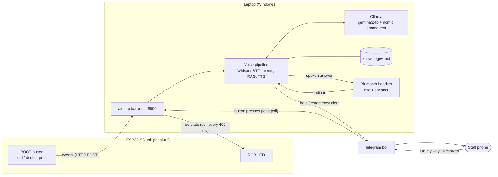

# FabAI

> **Setting up or recording the demo? Read [docs/HANDOFF.md](docs/HANDOFF.md) first.** The
> full [setup guide](docs/setup-guide.md) covers every step on your own Windows or macOS
> laptop, with the Wi-Fi and Telegram problems we actually hit.

A push-to-talk voice assistant for the SUTD Fabrication Lab: hold a button next to the
machine, ask how to use it, and hear a short answer taken only from the lab's own guides.
When the guides don't cover it, or something goes wrong, one double-press calls staff on
Telegram.

**The problem.** Fab Lab users get stuck on small, repeated questions (where is the power
button, which way does the build plate go, can I cut this material) at machines where
staff aren't standing next to them. Posted signs are easy to miss, and asking staff for
every step doesn't scale. FabAI answers those questions hands-free at the machine, refuses
anything outside the guides instead of guessing, and makes getting a human one gesture.

## Demo

> _Demo video / GIF goes here._

The 3-minute demo script is in [docs/demo-script.md](docs/demo-script.md).

## Architecture



The ESP32 has no microphone or speaker: it sends button events and shows the LED colour
the backend computes. Audio runs on the laptop's default input and output (a Bluetooth
headset). Everything except Telegram runs offline on the laptop. Detailed diagrams of the
voice pipeline and the help flow are in [docs/architecture.md](docs/architecture.md).

## Hardware

- **ESP32-S3 DevKit.** The BOOT button (GPIO0) is the talk button, and the on-board RGB LED
  (GPIO38) shows status. One unit per machine; the demo unit is `fabai-01` (3D printer).
- **Laptop** running Windows or macOS with 16 GB RAM. It runs the backend, Ollama, Whisper
  and TTS. A Windows laptop hosts the Wi-Fi hotspot the ESP32 joins; with a Mac, a phone
  hotspot at 2.4 GHz is used instead (see the setup guide).
- **Audio:** the laptop's built-in mic and speakers, set as the default input and output
  (Bluetooth earbuds proved unreliable: see the setup guide, section 6).

## Setup

### 1. Python backend

Requires Python 3.12 (`py -3.12`).

```powershell
cd backend
py -3.12 -m venv .venv
.venv\Scripts\activate
pip install -r requirements.txt -r requirements-dev.txt
copy .env.example .env        # then edit .env, see Configuration
```

### 2. Ollama models

Install [Ollama](https://ollama.com), then:

```powershell
ollama pull gemma3:4b
ollama pull nomic-embed-text
```

Ollama must be running (`http://127.0.0.1:11434`) when the backend starts. At startup the
backend embeds the knowledge base (cached in `backend/data/kb_cache.npz`) and sends one
warm-up chat so the first real question is fast.

### 3. Headset

Pair the headset in Windows Settings → Bluetooth, then set it as the default input and
output under Settings → System → Sound. Check it end to end (records 5 s, plays it back
and transcribes it with the same Whisper model as the backend):

```powershell
cd backend
python mic_diagnostic.py
```

### 4. Start the backend

```powershell
cd backend
python app.py
```

It prints the URL to enter in the ESP32 portal and where staff alerts go (Telegram or
console). The first time, Windows Defender Firewall asks whether Python may accept
connections. Click **Allow** (for private and public networks), or add the rule yourself
from an admin PowerShell:

```powershell
New-NetFirewallRule -DisplayName "FabAI backend" -Direction Inbound -Action Allow `
  -Program "C:\path\to\Capybara_Fablab\backend\.venv\Scripts\python.exe" -Profile Any
```

Without it, the ESP32 can't reach port 8000 and its LED blinks offline.

**Run exactly one backend.** Two backends fight over port 8000 and over Telegram's
`getUpdates` (only one poller receives staff button presses).

### 5. Wi-Fi: Windows Mobile Hotspot (what worked)

The ESP32 joins a hotspot on the laptop, so the demo doesn't depend on venue Wi-Fi.

1. Settings → Network & internet → **Mobile hotspot**: turn it on and note the network
   name and password.
2. The ESP32-S3 only supports **2.4 GHz**. If the hotspot band setting offers it, choose
   2.4 GHz. If Windows forces 5 GHz (it follows the band of the laptop's current Wi-Fi
   connection), open Device Manager → Network adapters → the **Realtek** Wi-Fi adapter →
   Advanced → **Preferred Band** → **2.4G first**, then turn the hotspot off and on.
3. Turn **power saving off** in the Mobile hotspot settings ("turn off hotspot when no
   devices are connected"), or the hotspot drops the ESP32 when idle.
4. On the hotspot, the laptop is always `192.168.137.1`, so the backend URL is
   **`http://192.168.137.1:8000`**.

### 6. Firmware

ESP-IDF 5.5 for the ESP32-S3:

```powershell
cd firmware
idf.py set-target esp32s3     # first time only
idf.py build
idf.py -p COM5 flash monitor  # your port
```

The serial monitor shows `FABAI_READY`, `DEVICE_ID=fabai-01` and `PORTAL_AP=http://192.168.4.1`.
Each unit's ID is `DEVICE_ID` in `firmware/main/device_manager.h`.

### 7. Telegram bot

1. In Telegram, message **@BotFather**, send `/newbot` and follow the prompts. It gives
   you the **bot token**.
2. Open a chat with your new bot (or add it to the staff group) and send it any message.
3. With the backend **stopped** (it consumes updates), open
   `https://api.telegram.org/bot<TOKEN>/getUpdates` in a browser and copy
   `result[].message.chat.id`. Group chat ids are negative.
4. Put both in `backend/.env`:

   ```
   TELEGRAM_BOT_TOKEN=<token from BotFather>
   TELEGRAM_CHAT_ID=<chat id>
   ```

Leave them empty to print alerts to the console instead. Staff presses are then simulated
with `POST /api/help/ack`. Never commit `.env`.

## Configuration

### ESP32 portal (Wi-Fi and backend URL)

1. Power the ESP32. With no saved Wi-Fi it opens an open access point **FabAI-Setup**.
2. Join **FabAI-Setup** from your phone and open **http://192.168.4.1**.
3. **Scan Wi-Fi**, pick the laptop hotspot, enter its password and **Save and Connect**.
4. Enter the backend URL **`http://192.168.137.1:8000`** and **Save Backend**. The Backend row
   turns to "Connected" once a state poll succeeds.
5. **Switch the phone back to normal Wi-Fi or mobile data.** FabAI-Setup has no internet,
   so a phone left on it misses Telegram alerts.

### `backend/.env`

Copy `backend/.env.example`. Real environment variables override `.env`. Main settings:

| Setting | Default | Meaning |
|---|---|---|
| `OLLAMA_URL` | `http://127.0.0.1:11434` | Ollama server |
| `OLLAMA_MODEL` / `EMBED_MODEL` | `gemma3:4b` / `nomic-embed-text` | chat and embedding models |
| `OLLAMA_KEEP_ALIVE` | `30m` | keep models loaded between questions |
| `OLLAMA_NUM_CTX` | `4096` | chat context window (smaller uses less RAM) |
| `WHISPER_MODEL` | `base.en` | faster-whisper model (CPU, int8) |
| `RAG_TOP_K` | `3` | chunks sent to the LLM |
| `RAG_THRESHOLD` | `0.55` | junk filter; below it the question is refused without an LLM call |
| `RAG_MACHINE_BOOST` | `0.05` | score bonus for chunks about the unit's own machine |
| `SESSION_TIMEOUT_S` / `SESSION_MAX_TURNS` | `120` / `6` | conversation memory per unit |
| `MIN_RECORD_S` / `MAX_RECORD_S` / `PRE_ROLL_S` | `0.5` / `15` / `0.5` | recording limits |
| `HELP_ACK_CLEAR_S` | `600` | an acknowledged help request clears itself after this |
| `TELEGRAM_BOT_TOKEN` / `TELEGRAM_CHAT_ID` | empty | staff alerts; empty means console |
| `PORT` | `8000` | backend port |

### Device map

`DEVICES` in `backend/config.py` maps each unit to its machine and location:

| Device id | Machine | Location |
|---|---|---|
| `fabai-01` | `3d-printer` | 3D Printing Lab |
| `fabai-02` | `laser-cutter` | Laser Lab |

Unknown ids use machine `all`, location "Fab Lab".

## Usage

| Gesture / phrase | Result |
|---|---|
| **Hold** the button, speak, **release** | One question and answer |
| Say **"next"** (hold, "next", release) | The next step of a procedure, read word for word from the guide |
| **Double-press** (two short taps) | Call staff on Telegram |
| Say **"call staff"** / "I need staff" | Call staff |
| Say an emergency ("there's a fire", "I'm hurt") | Fixed safety message straight away, and an EMERGENCY alert to staff |

Answers are one to three spoken sentences starting with the source ("According to the 3D
printer guide, ..."). Questions the guides don't cover get "Sorry, I don't have that in
the Fab Lab guides" and are logged for staff (`GET /api/unanswered`). For procedures,
the assistant ends with "Say next when you're ready." Follow-up questions within two
minutes use the previous question as context.

### LED

| LED | Meaning |
|---|---|
| off | idle |
| solid blue | listening (button held) |
| solid yellow | thinking |
| solid green | speaking |
| breathing red | staff called, waiting |
| solid purple | staff tapped "On my way" |
| 3 quick red flashes | error; try again |
| dim red blink every 2 s | **offline**: 3 state polls in a row failed (no Wi-Fi, no backend URL, or backend unreachable) |

While a question is in progress, its colour (blue, yellow, green) shows over the help
colour. When it finishes, the help colour comes back.

## Adding knowledge

Knowledge lives in `backend/knowledge/*.md`. Each file starts with YAML frontmatter, and
every `## ` heading becomes one retrievable chunk. Phrase headings as the question a user
would ask:

```markdown
---
machine: 3d-printer                # or laser-cutter, or all
type: sop
spoken_source: the 3D printer guide   # read aloud: "According to the 3D printer guide, ..."
origin: Fab Lab posted sign "Hands-On" (3D printing area)   # citation in the API
---

## What is the maximum SD card size?
Use a micro SD card of 32 GB or smaller.
```

- **Procedures** get a `## How do I use the X? (full procedure)` overview chunk plus
  `## Step 1: ...`, `## Step 2: ...` chunks. After the overview, "next" reads the steps
  word for word, without the LLM.
- Files without frontmatter are skipped with a warning.
- **`backend/knowledge/private/`** is loaded too but gitignored, for internal SUTD
  documents.
- Embeddings are cached and rebuilt automatically when any knowledge file changes.
- Run the eval (below) after editing knowledge.
- **Banned laser-cutter materials** are also matched in code (`backend/core/safety.py`):
  a question naming one always gets the laser cutter's "What materials are banned?"
  section. Keep that heading if you edit `laser-cutter.md`.

## API reference

All bodies are JSON. `device_id` defaults to `api` (machine `all`) where optional.

| Method and path | Body / query | Response |
|---|---|---|
| `GET /health` |  | `{status, service, ollama}` |
| `POST /api/device/register` | `{device_id}` | `{device_id, machine, location}` |
| `POST /api/device/heartbeat` | `{device_id}` | `{device_id, backend: "online"}` |
| `POST /api/device/event` | `{device_id, event, held_ms?}`, event is `talk_pressed`, `talk_released` (with `held_ms`) or `help_requested` | 202 `{accepted, ...}`; `{accepted: false, reason: "busy"}` while another turn runs |
| `GET /api/device/state?device_id=` |  | `{activity, help, led}` (the firmware polls this) |
| `POST /api/ask` | `{question, device_id?, speak?}` (1 to 2000 chars; `speak: true` also speaks it) | `{text, intent, sources: [{spoken_source, origin}], refused, best_score}`; 503 if Ollama fails |
| `POST /api/help/ack` | `{device_id, action}`, action `ack` or `resolve` | `{help}` (simulates the Telegram buttons) |
| `GET /api/unanswered` |  | list of `{ts, device_id, machine, question, best_score}` |

Example:

```powershell
curl.exe -s -X POST http://127.0.0.1:8000/api/ask -H "Content-Type: application/json" `
  -d '{\"device_id\":\"fabai-02\",\"question\":\"Can I cut PVC?\"}'
```

## Testing

```powershell
cd backend
pytest                       # unit + API tests with fakes: no hardware, no Ollama
pytest -m integration        # real Ollama + Whisper (IT1-IT4)
```

**Firmware host tests** (button gestures, plain C). Run them from **PowerShell, not Git
Bash**. On Windows, make and gcc come from [MSYS2](https://www.msys2.org)
(`pacman -S make mingw-w64-ucrt-x86_64-gcc`, with `C:\msys64\usr\bin` and
`C:\msys64\ucrt64\bin` on PATH). Under Git Bash, gcc fails with "Cannot create temporary
file in C:\Windows\".

```powershell
make -C firmware/test
```

**RAG eval.** Asks the 29 questions in `backend/tests/eval/questions.yaml` against a
running backend and prints id, pass/fail, intent, refused, best score and an answer
preview, then the pass rate (target 80%; currently 29/29). Start the backend for the eval
with a fresh session per question, and with Telegram disabled so the help and emergency
questions don't page staff (a space overrides `.env` and counts as unset; `''` would
delete the variable in PowerShell):

```powershell
$env:SESSION_TIMEOUT_S = '0'; $env:TELEGRAM_BOT_TOKEN = ' '; $env:TELEGRAM_CHAT_ID = ' '
python app.py
# in another terminal
python scripts/run_eval.py
```

Test cases and the latest results are in [docs/test-plan.md](docs/test-plan.md).

## Project structure

```
backend/
  app.py                 aiohttp routes, startup (warm-up, Telegram poller)
  config.py              settings from env/.env, device map
  core/                  pure logic, no hardware/network/model imports
    pipeline.py          button events -> STT -> intent -> RAG/LLM -> TTS, staff help
    intents.py           emergency / help / next / question
    prompts.py           system prompt and CONTEXT
    answer_text.py       source prefix, "Say next", filler and refusal handling
    safety.py            banned laser-cutter materials (safety net)
    steps.py             step-by-step procedure pointer
    sessions.py          per-device conversation memory
    device_state.py      activity + help status -> LED value
    speech_text.py       markdown to speakable text
  services/              adapters behind small classes (replaced by fakes in tests)
    audio_service.py     always-open mic with pre-roll
    stt_service.py       faster-whisper
    llm_service.py       Ollama chat + health
    embedder.py          Ollama embeddings
    knowledge.py         markdown loader, retrieval, embedding cache
    tts_service.py       Windows SAPI / macOS say
    notify_service.py    Telegram alerts and button long-poll
    unanswered_log.py    JSONL log of refused questions
  knowledge/             the guides (private/ is gitignored)
  scripts/run_eval.py    RAG eval
  tests/                 pytest suites, fakes, eval questions
  mic_diagnostic.py      headset check
firmware/
  main/                  ESP-IDF app: button gestures, backend client, LED, Wi-Fi portal
  test/                  host tests for button gestures
docs/
  build-plan.md          spec and decision log (section 9)
  test-plan.md           test cases and results
  architecture.md        diagrams
  demo-script.md         3-minute demo
```

## Troubleshooting

| Symptom | Fix |
|---|---|
| First answer takes 5 to 30 s | Laptop low on RAM, so Windows pages out the idle models. Close Edge, Creative Cloud and other heavy apps; start the backend a few minutes early and ask one warm-up question. |
| LED blinks dim red every 2 s | Offline: 3 state polls in a row failed. Check that the backend is running, the ESP32 is on the hotspot (2.4 GHz), the backend URL is `http://192.168.137.1:8000`, and the firewall allows Python. |
| Staff button presses do nothing | Only one backend may run. Check the log for `Telegram poll failed`. |
| `Telegram poll failed ... getaddrinfo failed` / `WinError 1236` | The laptop lost its network. Seen twice during testing (about 02:10 and 02:24 on 2026-09-24); the poller retries every 5 s and recovers by itself. Presses made during the outage arrive afterwards. |
| ESP32 can't see the hotspot | The hotspot is on 5 GHz. Set the Realtek Preferred Band to "2.4G first" (Setup, step 5). |
| Phone gets no Telegram alerts | It's still joined to FabAI-Setup (no internet). Switch networks. |
| "Sorry, I didn't catch that" | Hold the button for the whole question; check the headset is the default input (`python mic_diagnostic.py`). |

## After the hackathon

- Set the Realtek adapter's **Preferred Band** back to **No Preference**.
- Turn Mobile hotspot power saving back on if you want it.
- Revoke the demo bot token in @BotFather (`/revoke`) if it was shared.

## Limitations and roadmap

**Known limitations**
- The mic and speaker are the laptop's headset, so there is one conversation at a time
  across all units.
- gemma3:4b can add facts that aren't in the guides. For laser cutter materials, a safety
  net forces the banned-materials list into every question naming PVC, vinyl,
  polycarbonate, Lexan, HDPE, foam, fibreglass or carbon fibre, on every unit, and speaks
  the list word for word if the model refuses. Other materials rely on the prompt rule
  "never say a material is allowed unless CONTEXT lists it", so a material the guides
  don't name gets a refusal rather than a guess: name common materials in the knowledge
  files.
- Retrieval scores for off-topic and real questions overlap, so refusing relies on the
  LLM replying `NO_ANSWER` rather than on the threshold.
- The ESP32 needs 2.4 GHz Wi-Fi.

**Roadmap**
- Onboard I2S microphone and speaker on each unit, so units work independently.
- Multiple units, one per machine, with per-machine knowledge.
- A staff dashboard: live unit status, open help requests, history.
- Unanswered-question insights: group `/api/unanswered` to show which guides are missing
  what.

## Team

> _Team names and roles go here._
