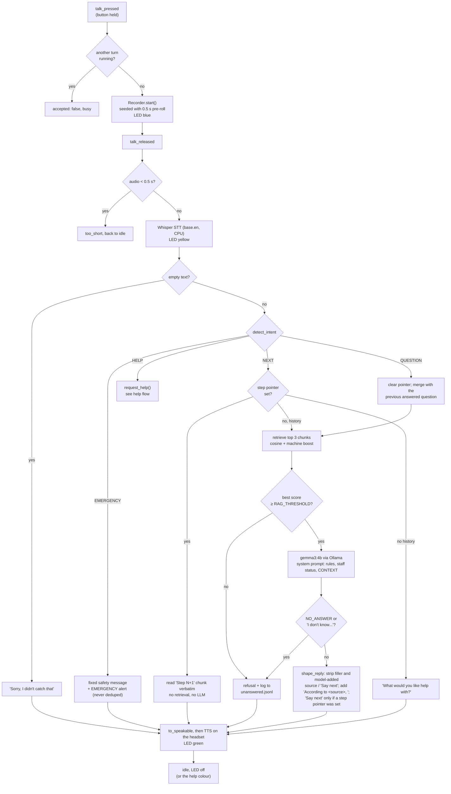

# FabAI architecture

The ESP32-S3 unit is a button and an LED. The laptop backend does everything else:
recording (always-open mic with 0.5 s pre-roll), Whisper transcription, intent detection,
retrieval over the markdown guides, the local LLM, text-to-speech, and staff alerts.
`core/` holds pure logic, and `services/` wraps audio, models, HTTP and the OS behind small
classes, so every test can use fakes. Decisions are logged in
[build-plan.md section 9](build-plan.md).

## Voice flow

One turn from button press to spoken answer (`core/pipeline.py`).



The backend computes the LED from activity and help status (`core/device_state.py`), and
the firmware polls `GET /api/device/state` every ~400 ms and renders it. Activity colours
(blue, yellow, green, red flash) show over the help colours (breathing red, purple).

## Staff help flow

Double-press on the unit, the voice phrase "call staff", or an emergency.

```mermaid
sequenceDiagram
    autonumber
    actor User
    participant ESP as ESP32 unit
    participant BE as Backend (laptop)
    participant TG as Telegram Bot API
    actor Staff as Staff phone

    User->>ESP: double-press
    ESP->>BE: POST /api/device/event help_requested
    BE->>BE: cancel any recording, help = pending
    BE->>TG: sendMessage (unit, machine, location, time,<br/>last 3 questions) + [On my way] [Resolved]
    TG-->>Staff: alert
    BE-->>ESP: 202 accepted
    BE->>User: speaks "I've called Fab Lab staff. Please stay by the machine."
    ESP->>BE: GET /api/device/state (every ~400 ms)
    BE-->>ESP: led = red_pulse (breathing red)

    Note over BE,TG: the backend long-polls getUpdates for button presses

    Staff->>TG: taps On my way
    TG-->>BE: callback_query ack:fabai-01:<help id>
    BE->>BE: help = acknowledged
    BE->>TG: answerCallbackQuery + edit the message status
    BE->>User: speaks "A staff member is on the way."
    ESP->>BE: GET /api/device/state
    BE-->>ESP: led = purple

    Staff->>TG: taps Resolved
    TG-->>BE: callback_query resolve:fabai-01:<help id>
    BE->>BE: help = none
    ESP->>BE: GET /api/device/state
    BE-->>ESP: led = off

    Note over BE: a second request while pending is not re-sent ("already called");<br/>an emergency is always sent, marked EMERGENCY;<br/>acknowledged clears itself after 10 minutes;<br/>stale help ids from old messages are ignored
```

Without Telegram settings, the alert is printed to the backend console and
`POST /api/help/ack {"device_id", "action": "ack" | "resolve"}` stands in for the staff
buttons. While help is pending or acknowledged, questions the guides can't answer get the
staff status ("Staff were called at 14:05 and should be with you shortly.") instead of the
normal refusal.
